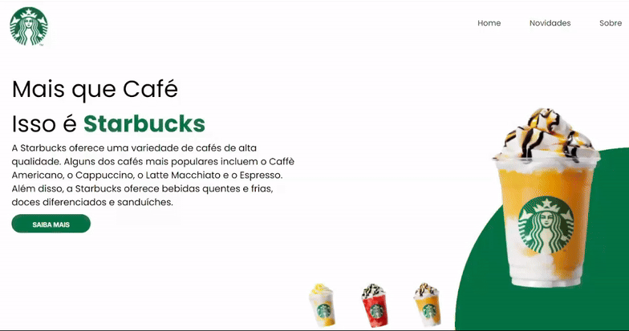
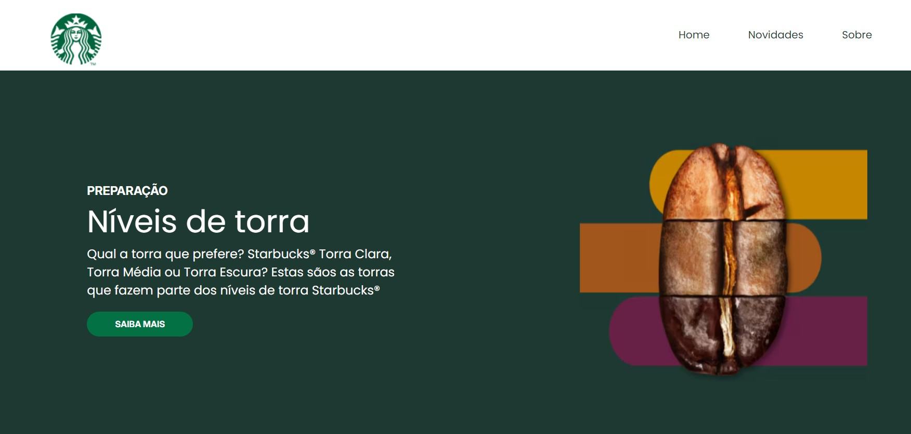

<h1 align="center" style="font-weight: bold;">Desafio Starbucks 💻</h1>

    <b>Projeto do curso Vai na Web. Esse projeto consiste na recriação visual do site do Starbucks, de forma responsiva, utilizando React e HTML.</b>

     <a href="https://desafio-starbucks-leticia-magalhaes.vercel.app/">📱 Acesse o site</a>

<h2 id="layout">🎨 Layout</h2>

    
    

<h2 id="technologies">💻 Tecnologias</h2>

- React
- Styled Components
- HTML

